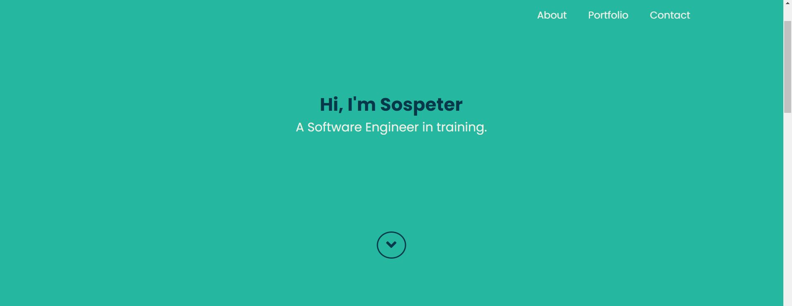
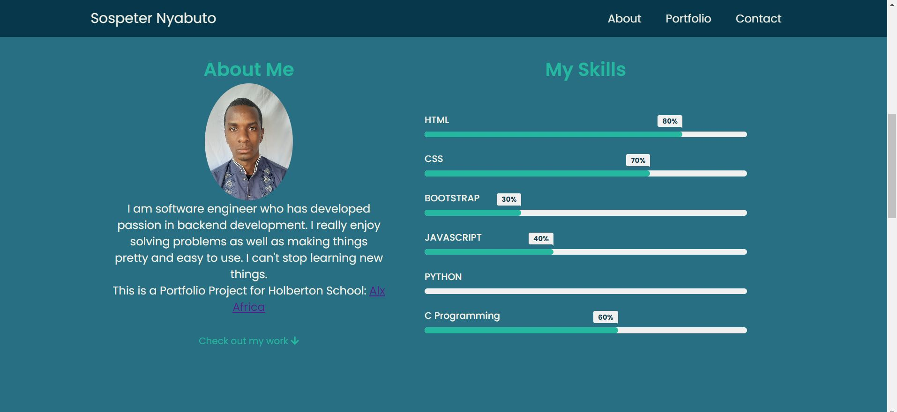
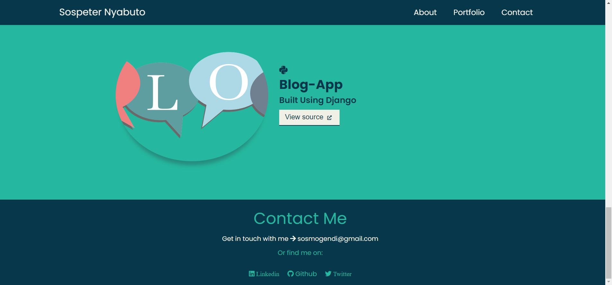

# Portfolio

## Introduction
This is my personal portfolio, showcasing my skills and projects. It includes a landing page, portfolio section, contact form, and skill set overview.

**Deployed Site:** [Link to Deployed Site](https://sosmogendi.github.io/Portfolio/)  
**Final Project Blog Article:** [Link to Blog Article](https://sosmogendi.github.io/Portfolio/)  
**Author's LinkedIn:** [Author's LinkedIn Profile](https://www.linkedin.com/in/sospeter-nyabuto/)

## Installation
To run this project locally, follow these steps:
1. Clone the repository: `git clone https://github.com/sosmogendi/Portfolio.git`
2. Navigate to the project directory: `cd Portfolio`
3. Install dependencies: `npm install`
4. Run the application: `npm start`

## Usage
Here are the steps to use the project:
- Navigate through the landing page, portfolio section, and contact form.
- Explore different project sections.

## Contributing
Contributions are welcome! If you wish to contribute, follow these steps:
1. Fork the repository.
2. Create your branch: `git checkout -b feature/YourFeature`
3. Commit your changes: `git commit -m 'Add YourFeature'`
4. Push to the branch: `git push origin feature/YourFeature`
5. Open a pull request.

## Deployed Project
- [link to deployed Project ](https://sosmogendi.github.io/Portfolio/)

## Licensing
This is a free project under development.

## Screenshots

## Resources
- [What Your Code Repository Says About You](https://linktoarticle.com)
- [Awesome List of READMEs](https://linktoawesomelist.com)
